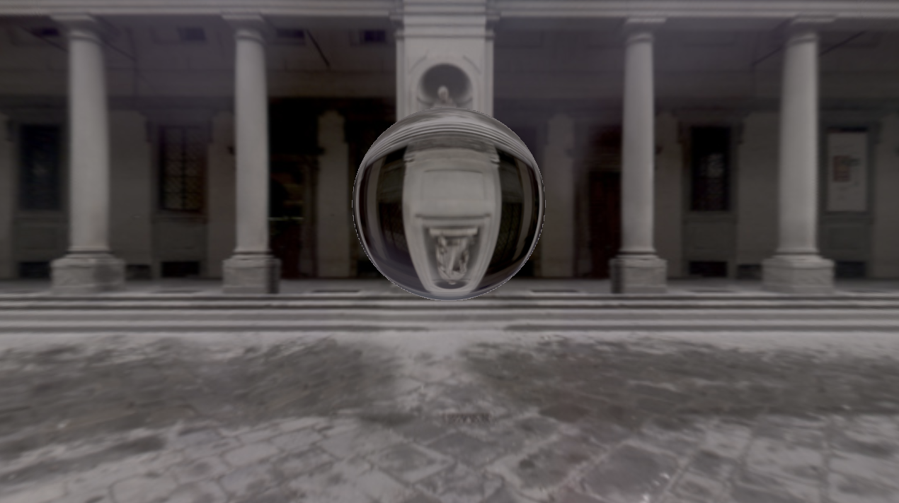

# Project Name

A basic architecture that demonstrate scenes using Ray Tracing techniques. This repo is built for future projects. Two Ray Tracing scenes are demonstrated here. One can also see the shaders I posted on The Shadertoy.

## Links

- [Ray Tracing and Phong Shading](https://www.shadertoy.com/view/l3l3Rl)
- [Glass Ball -- Refraction and Reflection](https://www.shadertoy.com/view/XXfGzl)

## Screenshots

*Ray Tracing and Phong Shading*

*Refraction and Reflection*

## Installation

Clone the repo and type make.
Be sure to install GLFW if you are mac users.
For more references, plesae check the demo of ImGUI.

## Usage

type `make`
type `./myApp`

## Contributing

If you want to contribute to this project, follow these steps.

1. Fork the project
2. Create your feature branch (`git checkout -b feature/YourFeature`)
3. Commit your changes (`git commit -m 'Add some feature'`)
4. Push to the branch (`git push origin feature/YourFeature`)
5. Open a pull request

## Acknowledgements

Credits to the Cherno, who teaches me how to set up basic OpenGL code structure.
Credits to Darko Supe, who teaches me the basic ray tracing techniques.

